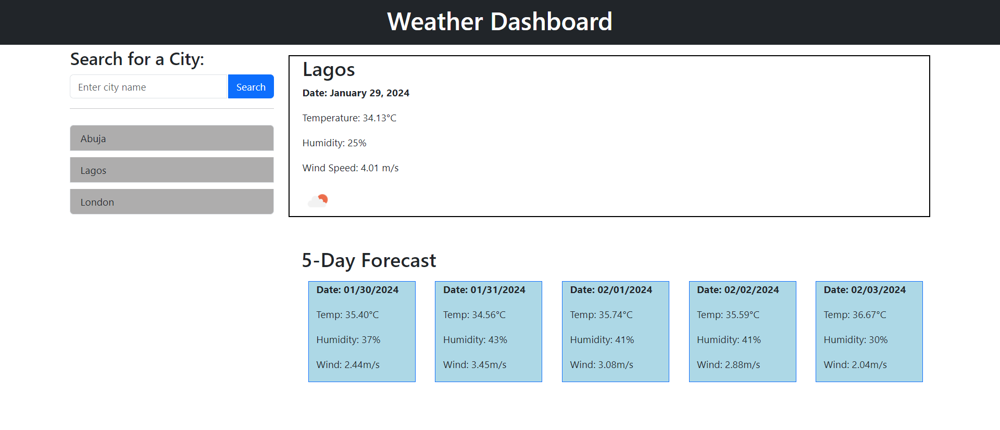

# Weather-Dashboard

## Description

I created a weather dashboard using the Openweather API to get real time weather information which is fed to the user. The user makes a request by typing a city name in an input field and then clicking the search button. This then triggers a fetch request from the API and displays the data on the dashboard for the user. The data displayed on the dashboard is the current date, temperature, humidity and wind speed of the city requested by the user. In addition to that, the user is also presented with a 5-Day forecast displaying the weather conditions. This enables the user to plan their journey accordingly if they wish to travel to the city.

I have been able to learn how to make fetch calls to external APIs and apply what I learnt by building a real world project that can be used by consumers.

## Installation

No installation required. All you need is a browser with functional internet connection to access the site.

## Usage

This is how the page looks like when it is visited for the first time.

md
    

There is an input field on the left hand side where you can type a city of your choice. Once that is done, click 'Search' as shown below.

md
    

The image displays the current weather information for the city at the top of the page alongside a 5-day forecast of the weather conditions for that specific city. 

On the left-hand side, the user's search history is saved so they know what city they have searched. The search history is clickable so the user can view the data again without having to type the city name again. This can be seen below.

md
    
    
    